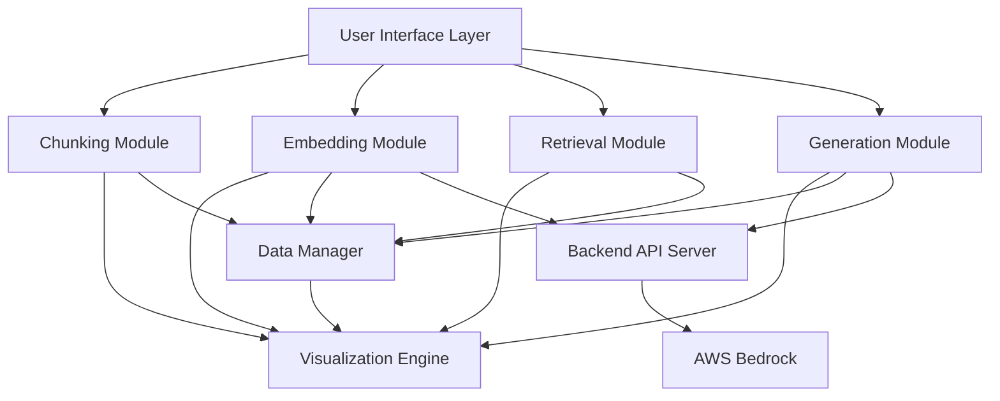

# Design Document

## Overview

The RAG Pipeline Educator is a client-side web application built with modern JavaScript frameworks to provide real-time, interactive demonstrations of RAG concepts. The architecture emphasizes modularity, performance, and educational clarity through visual feedback and hands-on experimentation.

## Architecture

### High-Level Architecture



### Technology Stack

- **Frontend Framework**: React with TypeScript for component-based architecture and type safety
- **Visualization**: D3.js for custom interactive visualizations and animations
- **AI Services**: AWS Bedrock for embedding generation and text generation capabilities
- **Backend**: Node.js/Express API server for AWS Bedrock integration
- **Styling**: Tailwind CSS for responsive design and consistent theming
- **State Management**: Zustand for lightweight, modular state management
- **Build Tool**: Vite for fast development and optimized production builds

## Components and Interfaces

### Core Application Structure

```typescript
interface RAGEducatorApp {
  modules: {
    chunking: ChunkingModule;
    embedding: EmbeddingModule;
    retrieval: RetrievalModule;
    generation: GenerationModule;
  };
  visualizationEngine: VisualizationEngine;
  dataManager: DataManager;
  tourGuide: TourGuide;
}
```

### Chunking Module

**Purpose**: Demonstrate different text segmentation strategies with real-time parameter adjustment.

**Key Components**:
- Strategy selector (fixed-size, semantic, sentence-based, paragraph-based)
- Parameter controls (chunk size, overlap, similarity thresholds)
- Text display with chunk boundary visualization
- Metrics dashboard (chunk count, sizes, overlap statistics)

**Interface**:
```typescript
interface ChunkingModule {
  strategy: ChunkingStrategy;
  parameters: ChunkingParameters;
  processText(text: string): Chunk[];
  visualizeChunks(chunks: Chunk[]): void;
  updateParameters(params: Partial<ChunkingParameters>): void;
}
```

### Embedding Module

**Purpose**: Visualize vector representations and similarity relationships between text chunks.

**Key Components**:
- 2D/3D vector space visualization using dimensionality reduction (t-SNE/UMAP)
- Interactive similarity threshold controls
- Cluster highlighting and connection visualization
- Embedding model comparison interface
- Hover interactions showing chunk content and similarity scores

**Interface**:
```typescript
interface EmbeddingModule {
  model: BedrockEmbeddingModel;
  generateEmbeddings(chunks: Chunk[]): Promise<Embedding[]>;
  visualizeEmbeddings(embeddings: Embedding[]): void;
  calculateSimilarity(embedding1: Embedding, embedding2: Embedding): number;
  updateSimilarityThreshold(threshold: number): void;
}

interface BedrockEmbeddingModel {
  modelId: 'amazon.titan-embed-text-v1' | 'cohere.embed-english-v3' | 'cohere.embed-multilingual-v3';
  dimensions: number;
}
```

### Retrieval Module

**Purpose**: Demonstrate query matching and ranking mechanisms with different search strategies.

**Key Components**:
- Query input interface
- Search mode toggle (keyword, semantic, hybrid)
- Real-time result ranking and scoring
- Retrieved chunk highlighting in original text
- Parameter controls for result limits and scoring weights

**Interface**:
```typescript
interface RetrievalModule {
  searchMode: SearchMode;
  performSearch(query: string, chunks: Chunk[]): SearchResult[];
  rankResults(results: SearchResult[]): SearchResult[];
  visualizeResults(results: SearchResult[]): void;
  updateSearchParameters(params: SearchParameters): void;
}
```

### Generation Module

**Purpose**: Show how retrieved context is integrated into prompts and affects response generation.

**Key Components**:
- Prompt construction visualization
- Context window management demonstration
- Multiple response generation with different context combinations
- Parameter controls for context selection and generation settings
- Response quality comparison interface

**Interface**:
```typescript
interface GenerationModule {
  model: BedrockGenerationModel;
  constructPrompt(query: string, context: Chunk[]): string;
  generateResponse(prompt: string): Promise<GenerationResult[]>;
  visualizePromptConstruction(prompt: string): void;
  updateGenerationParameters(params: GenerationParameters): void;
}

interface BedrockGenerationModel {
  modelId: 'anthropic.claude-3-sonnet-20240229-v1:0' | 'anthropic.claude-3-haiku-20240307-v1:0' | 'amazon.titan-text-premier-v1:0';
  maxTokens: number;
  temperature: number;
}
```

### Visualization Engine

**Purpose**: Provide consistent, performant visual feedback across all modules.

**Key Components**:
- D3.js-based rendering system
- Animation and transition management
- Interactive element handling (hover, click, drag)
- Responsive layout adaptation
- Performance optimization for real-time updates

**Interface**:
```typescript
interface VisualizationEngine {
  renderChunkBoundaries(chunks: Chunk[], container: HTMLElement): void;
  renderEmbeddingSpace(embeddings: Embedding[], container: HTMLElement): void;
  renderSearchResults(results: SearchResult[], container: HTMLElement): void;
  renderPromptConstruction(prompt: string, container: HTMLElement): void;
  animateTransition(fromState: any, toState: any): void;
}
```

## Data Models

### Core Data Structures

```typescript
interface Chunk {
  id: string;
  content: string;
  startIndex: number;
  endIndex: number;
  metadata: ChunkMetadata;
  embedding?: Embedding;
}

interface Embedding {
  vector: number[];
  model: string;
  dimensions: number;
}

interface SearchResult {
  chunk: Chunk;
  score: number;
  matchType: 'keyword' | 'semantic' | 'hybrid';
  highlights: TextHighlight[];
}

interface GenerationResult {
  response: string;
  contextUsed: Chunk[];
  confidence: number;
  parameters: GenerationParameters;
}
```

### Configuration Models

```typescript
interface ChunkingParameters {
  strategy: 'fixed-size' | 'semantic' | 'sentence' | 'paragraph';
  chunkSize?: number;
  overlap?: number;
  similarityThreshold?: number;
}

interface SearchParameters {
  mode: 'keyword' | 'semantic' | 'hybrid';
  resultLimit: number;
  similarityThreshold: number;
  keywordWeight?: number;
  semanticWeight?: number;
}

interface GenerationParameters {
  maxContextLength: number;
  contextSelectionStrategy: 'top-k' | 'threshold' | 'diverse';
  temperature: number;
}
```

## Error Handling

### Client-Side Error Management

**AWS Bedrock Integration Failures**:
- Fallback to pre-computed embeddings for demo purposes when Bedrock is unavailable
- Graceful degradation with cached responses for generation demonstrations
- User notification with offline mode capabilities
- Retry logic with exponential backoff for transient AWS service issues

**Performance Issues**:
- Debounced parameter updates to prevent excessive re-computation
- Progressive loading for large text samples
- Memory management for visualization elements

**Browser Compatibility**:
- Feature detection for WebGL and advanced Canvas features
- Fallback visualizations for older browsers
- Polyfills for missing JavaScript features

### User Experience Error Handling

```typescript
interface ErrorHandler {
  handleEmbeddingError(error: Error): void;
  handleVisualizationError(error: Error): void;
  handlePerformanceIssue(metrics: PerformanceMetrics): void;
  showUserFriendlyMessage(errorType: ErrorType): void;
}
```

## Testing Strategy

### Unit Testing
- Individual module functionality testing
- Data transformation and calculation accuracy
- Parameter validation and edge case handling
- Mock embedding generation for consistent test results

### Integration Testing
- Module interaction and data flow validation
- Visualization rendering accuracy
- State management consistency across modules
- Performance benchmarking for real-time updates

### User Experience Testing
- Interactive element responsiveness
- Visual feedback accuracy and timing
- Accessibility compliance (keyboard navigation, screen readers)
- Cross-browser and device compatibility

### Educational Effectiveness Testing
- Concept comprehension validation through user feedback
- Learning progression tracking through guided tours
- Parameter exploration patterns analysis
- Collaborative learning scenario testing

## AWS Bedrock Integration

### Backend API Architecture

**Purpose**: Provide secure, efficient access to AWS Bedrock services while maintaining educational interactivity.

**Key Components**:
- Express.js API server with AWS SDK integration
- Request caching and batching for optimal Bedrock usage
- Authentication and rate limiting for hackathon environment
- WebSocket connections for real-time updates

**API Endpoints**:
```typescript
interface BedrockAPI {
  // Embedding endpoints
  POST /api/embeddings/generate: (chunks: string[]) => Promise<Embedding[]>;
  POST /api/embeddings/similarity: (embedding1: Embedding, embedding2: Embedding) => Promise<number>;
  
  // Generation endpoints
  POST /api/generate/response: (prompt: string, model: string) => Promise<GenerationResult>;
  POST /api/generate/compare: (prompt: string, models: string[]) => Promise<GenerationResult[]>;
  
  // Model information
  GET /api/models/embedding: () => Promise<BedrockEmbeddingModel[]>;
  GET /api/models/generation: () => Promise<BedrockGenerationModel[]>;
}
```

### Bedrock Model Configuration

**Embedding Models**:
- **Amazon Titan Embed Text v1**: Primary model for general text embedding
- **Cohere Embed English v3**: Alternative for English-specific optimizations
- **Cohere Embed Multilingual v3**: Support for multilingual demonstrations

**Generation Models**:
- **Claude 3 Sonnet**: Primary model for high-quality response generation
- **Claude 3 Haiku**: Fast model for real-time demonstrations
- **Amazon Titan Text Premier**: Alternative generation approach for comparison

### Cost Optimization Strategies

**Request Management**:
- Intelligent caching with TTL based on parameter combinations
- Request deduplication for identical chunk processing
- Batch processing for multiple chunks to reduce API calls
- Rate limiting to prevent excessive usage during hackathon

**Educational Efficiency**:
- Pre-computed embeddings for common demo texts
- Cached generation examples for popular queries
- Progressive enhancement - core functionality works without Bedrock
- Usage analytics to optimize model selection

## Performance Considerations

### Optimization Strategies

**Real-time Processing**:
- Caching layer for AWS Bedrock responses to minimize API calls
- Debounced parameter updates (300ms delay) to reduce Bedrock requests
- Incremental visualization updates
- Request batching for embedding generation to optimize Bedrock usage

**Visualization Performance**:
- Canvas-based rendering for large datasets
- Level-of-detail rendering for complex visualizations
- Efficient DOM manipulation with virtual scrolling
- Animation frame optimization for smooth transitions

**Memory Management**:
- Cleanup of visualization elements on module switches
- Efficient data structure reuse
- Garbage collection optimization for frequent updates
- Progressive loading for large text samples

## Deployment and Distribution

### Build Configuration
- Vite-based build system with code splitting
- Progressive Web App (PWA) configuration for offline usage
- Asset optimization and compression
- Environment-specific configuration management

### Hosting Strategy
- Static site deployment for hackathon reliability
- CDN distribution for global accessibility
- Offline-first architecture with service workers
- Minimal external dependencies for network independence