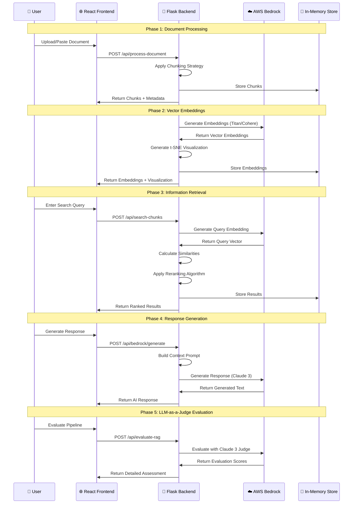

# 🏗️ RAG Pipeline Educator - Architecture Diagram

## 📊 System Architecture Overview

```mermaid
graph TB
    %% User Interface Layer
    subgraph "Frontend Layer"
        UI[🌐 React Frontend<br/>TypeScript + Vite + Tailwind]
        DEMO[🧪 Demo Pages<br/>test-reranking.html]
    end

    %% Application Layer
    subgraph "Backend Services"
        API[🐍 Python Flask API<br/>Port 5000]
        ROUTES[📡 API Routes<br/>/api/process-document<br/>/api/search-chunks<br/>/api/evaluate-rag]
    end

    %% RAG Pipeline Components
    subgraph "RAG Pipeline Core"
        subgraph "Phase 1: Document Processing"
            CHUNK[📄 Document Chunker<br/>4 Strategies:<br/>• Sentence-based<br/>• Fixed-size<br/>• Paragraph<br/>• Semantic]
        end
        
        subgraph "Phase 2: Vector Embeddings"
            EMB[🔢 Embedding Generator<br/>AWS Bedrock Models:<br/>• Titan v1 (1536D)<br/>• Titan v2 (1024D)<br/>• Cohere v3 (1024D)]
        end
        
        subgraph "Phase 3: Information Retrieval"
            SEARCH[🔍 Similarity Search<br/>Metrics:<br/>• Cosine<br/>• Euclidean<br/>• Dot Product]
            RERANK[🔄 Reranking Engine<br/>6 Methods:<br/>• BM25 Hybrid<br/>• Cross-Encoder<br/>• Diversity<br/>• Length Penalty<br/>• Keyword Boost<br/>• None]
        end
        
        subgraph "Phase 4: Response Generation"
            GEN[🤖 AI Generator<br/>AWS Bedrock Models:<br/>• Claude 3 Haiku<br/>• Claude 3 Sonnet<br/>• Titan Premier]
        end
        
        subgraph "Phase 5: Evaluation"
            EVAL[⚖️ LLM-as-a-Judge<br/>Claude 3 Evaluator<br/>4 Dimensions:<br/>• Relevance<br/>• Completeness<br/>• Quality<br/>• Faithfulness]
        end
    end

    %% AI Services Layer
    subgraph "AWS Bedrock Services"
        BEDROCK[☁️ AWS Bedrock<br/>us-east-1]
        
        subgraph "Embedding Models"
            TITAN1[🔹 Titan Text v1<br/>1536 dimensions]
            TITAN2[🔹 Titan Text v2<br/>1024 dimensions]
            COHERE[🔹 Cohere Embed v3<br/>1024 dimensions]
        end
        
        subgraph "Generation Models"
            CLAUDE_H[🧠 Claude 3 Haiku<br/>Fast & Cost-effective]
            CLAUDE_S[🧠 Claude 3 Sonnet<br/>Balanced Performance]
            TITAN_P[🧠 Titan Premier<br/>Amazon's Latest]
        end
    end

    %% Data Processing Layer
    subgraph "Data Processing & ML"
        NLTK[📚 NLTK<br/>Tokenization<br/>Stopwords]
        SKLEARN[🔬 Scikit-learn<br/>TF-IDF<br/>Cosine Similarity<br/>t-SNE Visualization]
        NUMPY[🔢 NumPy<br/>Vector Operations]
        PANDAS[📊 Pandas<br/>Data Manipulation]
        LANGCHAIN[🔗 LangChain<br/>Semantic Chunking<br/>Prompt Templates]
    end

    %% Visualization Layer
    subgraph "Visualization & UI"
        D3[📈 D3.js<br/>Interactive Charts<br/>t-SNE Plots<br/>Similarity Heatmaps]
        CHARTS[📊 Custom Visualizations<br/>Embedding Space<br/>Chunk Distribution<br/>Score Comparisons]
    end

    %% Infrastructure Layer
    subgraph "Infrastructure & Deployment"
        subgraph "Local Development"
            LOCAL[💻 Local Environment<br/>Node.js 18+<br/>Python 3.8+]
        end
        
        subgraph "AWS Cloud Deployment"
            EC2[🖥️ EC2 Instance<br/>t3.medium<br/>Amazon Linux 2]
            ECS[🐳 ECS Fargate<br/>Containerized<br/>Auto-scaling]
            LAMBDA[⚡ Lambda Functions<br/>Serverless Backend]
            APPRUNNER[🚀 App Runner<br/>Managed Deployment]
        end
        
        subgraph "Container Support"
            DOCKER[🐳 Docker<br/>Multi-stage Builds<br/>Frontend + Backend]
            COMPOSE[🔧 Docker Compose<br/>Local Orchestration<br/>Nginx Proxy]
        end
    end

    %% Data Flow Connections
    UI --> API
    DEMO --> API
    API --> CHUNK
    CHUNK --> EMB
    EMB --> BEDROCK
    BEDROCK --> TITAN1
    BEDROCK --> TITAN2
    BEDROCK --> COHERE
    EMB --> SEARCH
    SEARCH --> RERANK
    RERANK --> GEN
    GEN --> BEDROCK
    BEDROCK --> CLAUDE_H
    BEDROCK --> CLAUDE_S
    BEDROCK --> TITAN_P
    GEN --> EVAL
    EVAL --> BEDROCK

    %% Processing Dependencies
    CHUNK --> NLTK
    SEARCH --> SKLEARN
    SEARCH --> NUMPY
    CHUNK --> LANGCHAIN
    API --> PANDAS

    %% Visualization Connections
    UI --> D3
    UI --> CHARTS
    EMB --> D3
    SEARCH --> CHARTS

    %% Infrastructure Connections
    API --> LOCAL
    API --> EC2
    API --> ECS
    API --> LAMBDA
    API --> APPRUNNER
    DOCKER --> COMPOSE

    %% Styling
    classDef frontend fill:#e1f5fe,stroke:#01579b,stroke-width:2px
    classDef backend fill:#f3e5f5,stroke:#4a148c,stroke-width:2px
    classDef ai fill:#fff3e0,stroke:#e65100,stroke-width:2px
    classDef data fill:#e8f5e8,stroke:#1b5e20,stroke-width:2px
    classDef infra fill:#fce4ec,stroke:#880e4f,stroke-width:2px
    classDef viz fill:#f1f8e9,stroke:#33691e,stroke-width:2px

    class UI,DEMO frontend
    class API,ROUTES,CHUNK,EMB,SEARCH,RERANK,GEN,EVAL backend
    class BEDROCK,TITAN1,TITAN2,COHERE,CLAUDE_H,CLAUDE_S,TITAN_P ai
    class NLTK,SKLEARN,NUMPY,PANDAS,LANGCHAIN data
    class LOCAL,EC2,ECS,LAMBDA,APPRUNNER,DOCKER,COMPOSE infra
    class D3,CHARTS viz
```

## 🔄 Data Flow Architecture



## 🏗️ Component Architecture

### Frontend Architecture (React + TypeScript)
```
src/
├── components/
│   ├── RAGPipelineEducator.tsx     # Main orchestrator
│   ├── phases/
│   │   ├── ChunkingPhase.tsx       # Document processing UI
│   │   ├── EmbeddingPhase.tsx      # Vector embedding controls
│   │   ├── RetrievalPhase.tsx      # Search & reranking UI
│   │   ├── GenerationPhase.tsx     # AI response generation
│   │   └── EvaluationPhase.tsx     # LLM-as-a-Judge interface
│   └── visualizations/
│       ├── RetrievalVisualization.tsx  # t-SNE plots
│       └── ChunkingVisualization.tsx   # Chunk analysis
├── types/                          # TypeScript interfaces
└── utils/                          # Helper functions
```

### Backend Architecture (Python Flask)
```
python_backend/
├── app.py                          # Main Flask application
├── services/
│   ├── BedrockService              # AWS Bedrock integration
│   ├── DocumentProcessor           # Chunking algorithms
│   └── EvaluationService           # LLM-as-a-Judge logic
├── models/
│   ├── BedrockEmbeddings          # LangChain integration
│   └── ChunkingStrategies         # Document processing
└── utils/
    ├── reranking_algorithms.py     # 6 reranking methods
    └── evaluation_prompts.py       # Evaluation templates
```

## 🔧 Technology Stack Details

### Frontend Technologies
- **React 18**: Component-based UI framework
- **TypeScript**: Type-safe JavaScript development
- **Vite**: Fast build tool and dev server
- **Tailwind CSS**: Utility-first CSS framework
- **D3.js**: Interactive data visualizations
- **Zustand**: Lightweight state management

### Backend Technologies
- **Python 3.9+**: Core programming language
- **Flask**: Lightweight web framework
- **Flask-CORS**: Cross-origin resource sharing
- **LangChain**: AI application framework
- **NLTK**: Natural language processing
- **Scikit-learn**: Machine learning algorithms
- **NumPy**: Numerical computing
- **Pandas**: Data manipulation

### AI & ML Services
- **AWS Bedrock**: Managed AI service
- **Claude 3 (Haiku/Sonnet)**: Anthropic's language models
- **Amazon Titan**: AWS embedding and generation models
- **Cohere Embed**: Advanced embedding models

### Infrastructure & Deployment
- **Docker**: Containerization platform
- **Docker Compose**: Multi-container orchestration
- **AWS EC2**: Virtual machine instances
- **AWS ECS Fargate**: Serverless containers
- **AWS Lambda**: Serverless functions
- **AWS App Runner**: Managed container service
- **CloudFormation**: Infrastructure as code
- **Nginx**: Reverse proxy and load balancer

## 🔄 RAG Pipeline Flow

### 1. Document Processing Pipeline
```
Raw Document → Cleaning → Chunking Strategy → Chunks
                ↓
        [Sentence | Fixed-size | Paragraph | Semantic]
                ↓
        Metadata Extraction → Storage
```

### 2. Embedding Generation Pipeline
```
Text Chunks → AWS Bedrock → Embedding Model → Vectors
                ↓              ↓
        [Titan v1 | Titan v2 | Cohere v3]
                ↓
        t-SNE Visualization → Storage
```

### 3. Retrieval & Reranking Pipeline
```
Query → Embedding → Similarity Search → Initial Results
         ↓              ↓                    ↓
    [Bedrock]    [Cosine|Euclidean|Dot]     ↓
                                            ↓
                    Reranking Algorithm → Final Results
                            ↓
        [BM25 | Cross-Encoder | Diversity | Length | Keyword | None]
```

### 4. Generation Pipeline
```
Query + Retrieved Chunks → Context Building → Prompt Template
                                ↓
                        AWS Bedrock Generation
                                ↓
                    [Claude 3 Haiku | Sonnet | Titan Premier]
                                ↓
                        Generated Response
```

### 5. Evaluation Pipeline
```
Query + Chunks + Response → Evaluation Prompts → Claude 3 Judge
                                ↓
                    [Relevance | Completeness | Quality | Faithfulness]
                                ↓
                        Scores + Explanations + Summary
```

## 🌐 Deployment Architecture Options

### Local Development
```
Developer Machine
├── Node.js Frontend (Port 3000)
├── Python Backend (Port 5000)
└── AWS Bedrock (Remote API)
```

### AWS EC2 Deployment
```
EC2 Instance (t3.medium)
├── Nginx Reverse Proxy (Port 80)
├── React Frontend (Port 3000)
├── Python Backend (Port 5000)
├── PM2 Process Manager
└── CloudWatch Logging
```

### Containerized Deployment
```
Docker Environment
├── Frontend Container (React + Nginx)
├── Backend Container (Python + Flask)
├── Nginx Proxy Container
└── AWS Bedrock (External Service)
```

### Serverless Deployment
```
AWS Serverless Stack
├── Lambda Functions (Backend Logic)
├── API Gateway (REST API)
├── S3 + CloudFront (Frontend)
└── AWS Bedrock (AI Services)
```

## 📊 Performance & Scalability

### Throughput Metrics
- **Document Processing**: 100-1000 chunks/second
- **Embedding Generation**: 25 texts/batch (Bedrock limit)
- **Search & Reranking**: <100ms for 1000 chunks
- **Response Generation**: 1-5 seconds (model dependent)
- **Evaluation**: 10-30 seconds (comprehensive assessment)

### Scalability Considerations
- **Horizontal Scaling**: Multiple backend instances
- **Caching**: Redis for embeddings and results
- **Load Balancing**: Nginx or AWS ALB
- **Database**: PostgreSQL for persistent storage
- **CDN**: CloudFront for static assets

## 🔒 Security Architecture

### Authentication & Authorization
- **AWS IAM**: Service-to-service authentication
- **API Keys**: Bedrock access control
- **CORS**: Cross-origin request security
- **HTTPS**: Encrypted data transmission

### Data Security
- **Environment Variables**: Secure credential storage
- **VPC**: Network isolation (production)
- **Security Groups**: Firewall rules
- **Encryption**: Data at rest and in transit

---

This architecture provides a comprehensive, scalable, and educational platform for learning RAG systems with hands-on experimentation across all pipeline phases.